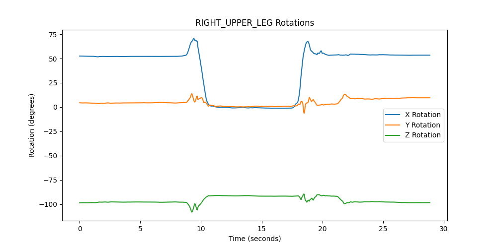
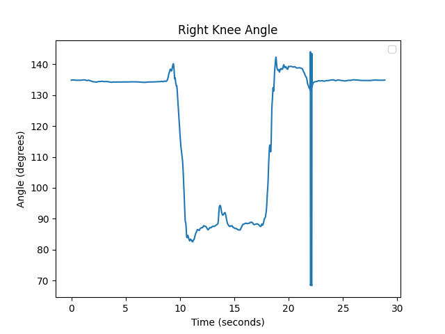

# bvh-analysis

BVH Analysis is a tool for analyzing and visualizing BVH files (Biovision Hierarchy), which are commonly used for motion capture data. This tool allows users to parse BVH files, extract motion capture data, and visualize joint rotations over time.

## Features

- Parse BVH files and extract motion capture data.
- Print the hierarchy of joints.
- Calculate angles between joints.
- Plot joint rotations over time.
- Plot joint angles over time.

## Installation
To install BVH Analysis, follow these steps:

1. Clone the repository
    ```sh
    git clone https://github.com/yourusername/bvh-analysis.git
    ```
2. Navigate to the project directory
    ```sh
    cd bvh-analysis
    ```
3. Install the required dependencies
    ```sh
    pip install -r requirements.txt
    ```

## Usage
To use BHV Analysis, follow these steps:

1. Place your BVH files in the project directory.
2. Open the `bvh_analysis.py` script in a text editor and change the filename in the following line to match your BVH file
    ```python
    bvh_filename = "BVH-Recording1.bvh"
    ```
3. Run the `bvh_analysis.py` script
    ```sh
    python bvh_analysis.py
    ```

## Example Plots
Below are example plots generated by the BVH Analysis tool, showcasing joint rotations and angles over time.

### Right Upper Leg Rotations


#### Right Knee Angle Over Time


## Dependencies
- `bvh`: A library for parsing BVH files.
- `matplotlib`: A library for creating static, animated, and interactive visualizations in Python.
- `numpy`: A library for numerical computations in Python.